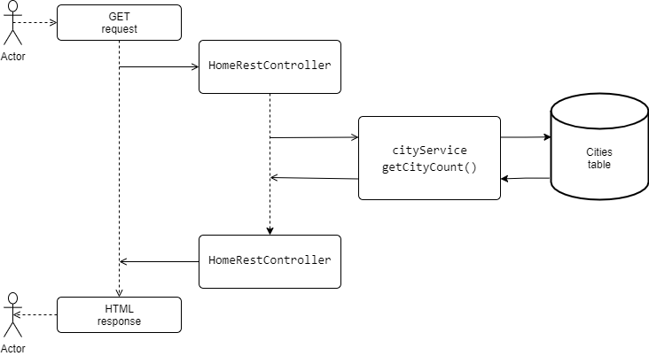

# Meteo Api (meteoapi)


L'Api rappresenta un micro-servizio che sfrutta le api presenti su [openweathermap.org](https://openweathermap.org/) per ottenere informazioni di ordine meteorologico nonché per generare delle statistiche sulla base dei dati raccolti.

È stato creato sfruttando il linguaggio Java attraverso il framework Spring con l'ausilio del Spring Boot.

Per la persistenza dei dati è stato utilizzato il DBMS MySQL (nella variante opensource MariaDb).

Per poter utilizzare si devono impostare alcuni parametri nel file **src\\main\\resources\\application.properties** che elenchiamo di seguito:

<font size="5">**server.port**</font>

+ indica la porta su cui sta operando il nostro microservice. Nel nostro caso impostato di default sul valore **8083**.

<font size="5">**meteoapi.pwd**</font>

-   deve contenere una stringa che rappresenta la password per accedere ad alcuni URL del micro‑servizio. Di default è impostata come "secret" e se viene reimpostata dev'essere corretta anche negli URL che ne fanno uso; URL che elencheremo di seguito.

<font size="5">**open_weather.api_key**</font>

-   rappresenta la API Key fornita da [openweathermap.org](https://openweathermap.org/) per accedere ai suoi servizi. Per ottenere la suddetta chiave ci si deve iscrivere sul sito del provider di servizi.

<font size="5">**spring.datasource.url**</font>

-   deve contenere la stringa di connessione al database ed il valore implicito è: **jdbc:mysql://localhost:3306/meteoapi?autoReconnect=true&useSSL=false&useLegacyDatetimeCode=false**, dove **meteoapi** rappresenta il nome del database in cui si salveranno i dati. Se il nome del vostro database è o sarà diverso andrà cambiato di conseguenza.

<font size="5">**spring.datasource.username**</font>

-   rappresenta il nome utente con cui si accede al database (es. root)

<font size="5">**spring.datasource.password**</font>

-   deve contenere la password di accesso al database. Può essere nullo
    se non c'è una password impostato per l'utente usato.

**Di seguito saranno elencati gli URL di accesso al micro-servizio con la descrizione afferente:**


| Metodo |        Indirizzo        |
|:------:|:-----------------------|
|   GET  | [http://localhost:8083](#home) |
|   GET  |[http://localhost:8083/cities?country=CodiceDelPaese&city=NomeCittà](#cities)                     |
|   GET  |[http://localhost:8083/cities/load/{{secret}}](#cities_load)                    |
|   GET  |[http://localhost:8083/cities/stop/{{secret}}](#cities_load_stop)                         |
|   GET  |[http://localhost:8083/forecast/seed/{{secret}}/?sleep=ValoreIntero&type=IntervalloDiTempo&country=CodiceDelPaese&city=NomeCittà](#seed)                        |
|   GET  |[http://localhost:8083/forecast/seed/{{secret}}/stop](#seed_stop)                         |
|   GET  |[http://localhost:8083/forecast/lookup/{{secret}}/?sleep=ValoreIntero&type=IntervalloDiTempo&country=CodiceDelPaese&city=NomeCittà](#forecast_lookup)                         |
|   GET  |[http://localhost:8083/forecast/lookup/{{secret}}/stop](#forecast_lookup_stop)                        |
|   GET  |[http://localhost:8083/forecast?country=CodiceDelPaese&city=NomeCittà](#forecast)                         |
|   GET  |[http://localhost:8083/forecast/statistics?start=DataInizio&end=DataFine&country=CodiceDelPaese&city=NomeCittà](#forecast_statistics)|

----

<span id="home"></span>

| Metodo |        Indirizzo        |
|:------:|:-----------------------|
|   GET  | <http://localhost:8083> |

- Rappresenta l'home page del micro-servizio e contiene il nome ed il numero di città presenti nel database, estratti da un elenco messo a disposizione da [openweathermap.org](https://openweathermap.org/).


----
<span id="cities"></span>

| Metodo |        Indirizzo        |
|:------:|:-----------------------|
|   GET  | <http://localhost:8083/cities?country=CodiceDelPaese&city=NomeCittà> |

- Restituisce informazioni riguardanti le città indicate mediante i parametri della chiamata. I valori restituiti riguardano le città caricate nel database del sito.

<font size="4">**Parametri:**</font>

***country***: codice del paese nel formato a due lettere. Si possono indicare più paesi separati da virgola e senza spazzi.

***city***: Nome della città o elenco dei nomi delle città separate da virgola e senza spazzi.

<font size="4">**Nota:**</font>

In tutti gli URL in cui compaiono i parametri country e city si possono usare i seguenti caratteri sostitutivi:

<font size="5">**!**</font> - il punto esclamativo sostituisce un carattere nella posizione corrente.

<font size="5">**\***</font> - l'asterisco sostituisce uno o più caratteri cominciando dalla posizione corrente.

**L'uso di tali caratteri permette di realizzare ricerche generiche come, per esempio, A\* nel parametro city andrà a ricercare tutte le città che iniziano con la lettera A.**

Il risultato è di tipo **json array** in cui sono riportate le informazioni relative alle città indicate mediante i parametri della chiamata

```
[
    {
        "id": 330264,
        "city_id": "3169070",
        "name": "Rome",
        "state": "",
        "country": "IT",
        "longitude": "12.4839",
        "latitude": "41.89474"
    }
]
```

----
<!-- blank line -->
<!-- blank line -->

<span id="cities_load"></span>

| Metodo |        Indirizzo        |
|:------:|:-----------------------|
|   GET  | <http://localhost:8083/cities/load/{{secret}}> |

- Questa chiamata permette di caricare automaticamente la lista delle città messa a disposizione da [openweathermap.org](https://openweathermap.org/) nel database dell’applicazione.

<font size="4">**Parametri:**</font>

***{{secret}}*** – è una stringa che rappresenta un UUID (universally unique identifier, cioè un identificativo unico universale). Può essere ottenuto sul sito [www.uuidgenerator.net](https://www.uuidgenerator.net/) e va impostato anche nel file **application.properties**.

----

<span id="cities_load_stop"></span>

| Metodo |        Indirizzo        |
|:------:|:-----------------------|
|   GET  | <http://localhost:8083/cities/stop/{{secret}}> |

- Questa chiamata ferma il caricamento automatico della lista contenete le città messa a disposizione da [openweathermap.org](https://openweathermap.org/) nel database dell’applicazione.

<font size="4">**Parametri:**</font>

***{{secret}}*** – è una stringa che rappresenta un UUID (universally unique identifier, cioè un identificativo unico universale). Può essere ottenuto sul sito [www.uuidgenerator.net](https://www.uuidgenerator.net/) e va impostato anche nel file **application.properties**.

----

<span id="seed"></span>

| Metodo |        Indirizzo        |
|:------:|:-----------------------|
|   GET  | <http://localhost:8083/forecast/seed/{{secret}}/?sleep=ValoreIntero&type=IntervalloDiTempo&country=CodiceDelPaese&city=NomeCittà> |

- Per ragioni legate al test dell’applicazione questa richiesta carica nel database previsioni meteorologiche fittizie per le città indicate nei parametri. È importante reimpostare la tabella nel database prima di inserire dati reali.

<font size="4">**Parametri:**</font>

***{{secret}}*** – è una stringa che rappresenta un UUID (universally unique identifier, cioè un identificativo unico universale). Può essere ottenuto sul sito [www.uuidgenerator.net](https://www.uuidgenerator.net/) e va impostato anche nel file **application.properties**.

***sleep***: valore intero che indica il tempo per quale si ferma il caricamento dei dati.

***type***: indica il tipo l’intervallo di tempo a cui fa riferimento il parametro sleep. I valori possono essere: milliseconds, seconds, minutes, hours, days.

***country***: codice del paese nel formato a due lettere. Si possono indicare più paesi separati da virgola e senza spazzi.

***city***: Nome della città o elenco dei nomi delle città separate da virgola e senza spazzi.

<font size="4">**Nota:**</font>

In tutti gli URL in cui compaiono i parametri country e city si possono usare i seguenti caratteri sostitutivi:

<font size="5">**!**</font> - il punto esclamativo sostituisce un carattere nella posizione corrente.

<font size="5">**\***</font> - l'asterisco sostituisce uno o più caratteri cominciando dalla posizione corrente.

**L'uso di tali caratteri permette di realizzare ricerche generiche come, per esempio, A\* nel parametro city andrà a ricercare tutte le città che iniziano con la lettera A.**

----

<span id="seed_stop"></span>

| Metodo |        Indirizzo        |
|:------:|:-----------------------|
|   GET  | <http://localhost:8083/forecast/seed/{{secret}}/stop> |

- Ferma l’inserimento dei dati meteo fittizi nel database.

<font size="4">**Parametri:**</font>

***{{secret}}*** – è una stringa che rappresenta un UUID (universally unique identifier, cioè un identificativo unico universale). Può essere ottenuto sul sito [www.uuidgenerator.net](https://www.uuidgenerator.net/) e va impostato anche nel file **application.properties**.


----

<span id="forecast_lookup"></span>

| Metodo |        Indirizzo        |
|:------:|:-----------------------|
|   GET  | <http://localhost:8083/forecast/lookup/{{secret}}/?sleep=ValoreIntero&type=IntervalloDiTempo&country=CodiceDelPaese&city=NomeCittà> |

- Questo link fa partire la raccolta automatica delle previsioni meteo dal sito [openweathermap.org](https://openweathermap.org/). Assicurarsi di svuotare la tabella dei dati fittizi se risultano caricati.


<font size="4">**Parametri:**</font>

***{{secret}}*** – è una stringa che rappresenta un UUID (universally unique identifier, cioè un identificativo unico universale). Può essere ottenuto sul sito [www.uuidgenerator.net](https://www.uuidgenerator.net/) e va impostato anche nel file **application.properties**.

***sleep***: valore intero che indica il tempo per quale si ferma il caricamento dei dati.

***type***: indica il tipo l’intervallo di tempo a cui fa riferimento il parametro sleep. I valori possono essere: milliseconds, seconds, minutes, hours, days.

***country***: codice del paese nel formato a due lettere. Si possono indicare più paesi separati da virgola e senza spazzi.

***city***: Nome della città o elenco dei nomi delle città separate da virgola e senza spazzi.

<font size="4">**Nota:**</font>

In tutti gli URL in cui compaiono i parametri country e city si possono usare i seguenti caratteri sostitutivi:

<font size="5">**!**</font> - il punto esclamativo sostituisce un carattere nella posizione corrente.

<font size="5">**\***</font> - l'asterisco sostituisce uno o più caratteri cominciando dalla posizione corrente.

**L'uso di tali caratteri permette di realizzare ricerche generiche come, per esempio, A\* nel parametro city andrà a ricercare tutte le città che iniziano con la lettera A.**

----

<span id="forecast_lookup_stop"></span>

| Metodo |        Indirizzo        |
|:------:|:-----------------------|
|   GET  | <http://localhost:8083/forecast/lookup/{{secret}}/stop> |

- Il presente link fa fermare la raccolta automatica delle previsioni meteo dal sito [openweathermap.org](https://openweathermap.org/).

<font size="4">**Parametri:**</font>

***{{secret}}*** – è una stringa che rappresenta un UUID (universally unique identifier, cioè un identificativo unico universale). Può essere ottenuto sul sito [www.uuidgenerator.net](https://www.uuidgenerator.net/) e va impostato anche nel file **application.properties**.

----

<span id="forecast"></span>

| Metodo |        Indirizzo        |
|:------:|:-----------------------|
|   GET  | <http://localhost:8083/forecast?country=CodiceDelPaese&city=NomeCittà> |

- Il suddetto link previsioni meteo in tempo reale dal sito [openweathermap.org](https://openweathermap.org/) per le città indicate nei parametri.

```
[
    {
        "id": null,
        "city_id": "3169070",
        "name": "Rome",
        "country": "IT",
        "forecast_date": "2021-03-23T14:36:20.681+00:00",
        "visibility": 10000,
        "pressure": 1017
    }
]
```

<font size="4">**Parametri:**</font>

***country***: codice del paese nel formato a due lettere. Si possono indicare più paesi separati da virgola e senza spazzi.

***city***: Nome della città o elenco dei nomi delle città separate da virgola e senza spazzi.

<font size="4">**Nota:**</font>

In tutti gli URL in cui compaiono i parametri country e city si possono usare i seguenti caratteri sostitutivi:

<font size="5">**!**</font> - il punto esclamativo sostituisce un carattere nella posizione corrente.

<font size="5">**\***</font> - l'asterisco sostituisce uno o più caratteri cominciando dalla posizione corrente.

**L'uso di tali caratteri permette di realizzare ricerche generiche come, per esempio, A\* nel parametro city andrà a ricercare tutte le città che iniziano con la lettera A.**

----

<span id="forecast_statistics"></span>

| Metodo |        Indirizzo        |
|:------:|:-----------------------|
|   GET  | <http://localhost:8083/forecast/statistics?start=DataInizio&end=DataFine&country=CodiceDelPaese&city=NomeCittà> |

- Mediante questo link si va a ottenere informazioni statistiche per i dati provenienti da [openweathermap.org](https://openweathermap.org/) e salvati automaticamente nel database. Il risultato è di tipo **json array**.

```
[
    {
        "id": 1,
        "row_n": 59,
        "country": "IT",
        "city_id": "3169070",
        "name": "Rome",
        "start": "2020-03-21 11:21:41",
        "end": "2021-03-23 20:23:20",
        "min_visibility": 10000,
        "max_visibility": 10000,
        "avg_visibility": 10000.0000,
        "var_visibility": 0,
        "min_pressure": 1017,
        "max_pressure": 1017,
        "avg_pressure": 1017.0000,
        "var_pressure": 0
    }
]
```


<font size="4">**Parametri:**</font>

***start***: è la data d’inizio della ricerca in formato yyyy-MM-dd HH:mm:ss, dove yyyy rappresenta l’anno, MM rappresenta il mese, dd rappresenta il giorno, HH l’ora in formato 24h, mm i minuti e ss i secondi.

***end***: è la data di fine ricerca in formato yyyy-MM-dd HH:mm:ss, dove yyyy rappresenta l’anno, MM rappresenta il mese, dd rappresenta il giorno, HH l’ora in formato 24h, mm i minuti e ss i secondi.

***country***: codice del paese nel formato a due lettere. Si possono indicare più paesi separati da virgola e senza spazzi.

***city***: Nome della città o elenco dei nomi delle città separate da virgola e senza spazzi.

<font size="4">**Nota:**</font>

In tutti gli URL in cui compaiono i parametri country e city si possono usare i seguenti caratteri sostitutivi:

<font size="5">**!**</font> - il punto esclamativo sostituisce un carattere nella posizione corrente.

<font size="5">**\***</font> - l'asterisco sostituisce uno o più caratteri cominciando dalla posizione corrente.

**L'uso di tali caratteri permette di realizzare ricerche generiche come, per esempio, A\* nel parametro city andrà a ricercare tutte le città che iniziano con la lettera A.**